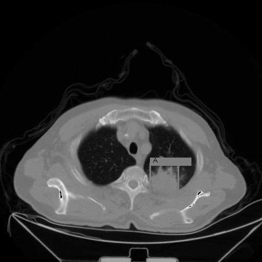

# lung_CT

Lung_CT Data survey

Data collected from [A Large-Scale CT and PET/CT Dataset for Lung Cancer Diagnosis (Lung-PET-CT-Dx)](https://wiki.cancerimagingarchive.net/pages/viewpage.action?pageId=70224216)

Data sample [Lung-PET-CT-Dx](./Lung-PET-CT-Dx/), [Annotation](./Annotation)

Data collected using [NBIADataRetriever](https://wiki.cancerimagingarchive.net/display/NBIA/Cancer+Imaging+Archive+User%27s+Guide#CancerImagingArchiveUser%27sGuide-InstallingtheNBIADataRetriever) and [notebook](./VisualizationTools/notebook.ipynb)

Sample processed image: [result](./Lung-PET-CT-Dx/Lung_Dx-A0001/1.3.6.1.4.1.14519.5.2.1.6655.2359.165554066086145834377508507990/result/)

Sample processed [gif](./Lung-PET-CT-Dx/Lung_Dx-A0001/1.3.6.1.4.1.14519.5.2.1.6655.2359.165554066086145834377508507990/result/result.gif)

